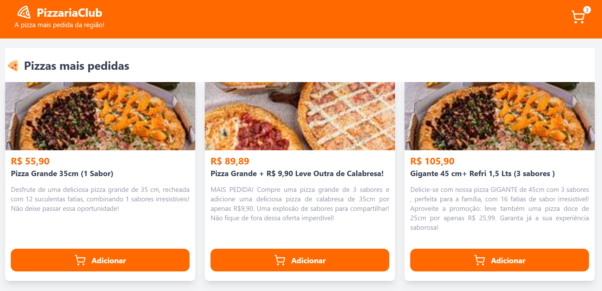
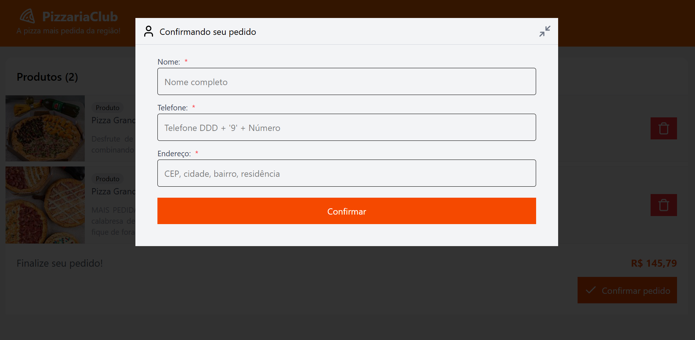
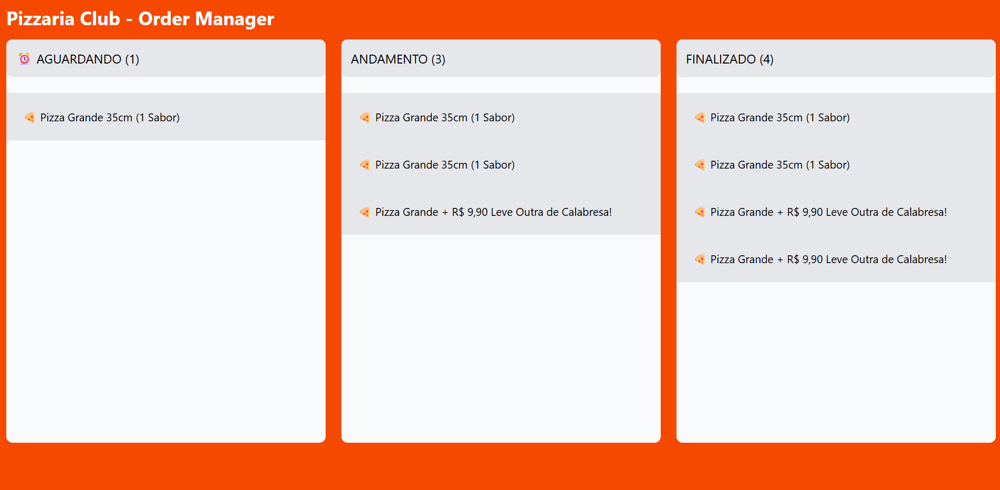

# Pizzaria Club

Este projeto foi desenvolvido no próposito de atender um cliente de pizzaria que necessitava de um sistema para usuários conseguirem fazer seus pedidos sem necessariamente conversar com atendente.

# Imagens do sistema

## Loja Virtual

## Gerenciador de pedidos

# Tecnologias

React Vite
Spring Boot
PostgreSQL